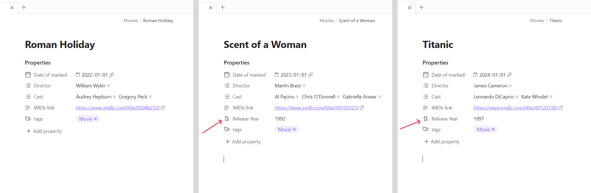
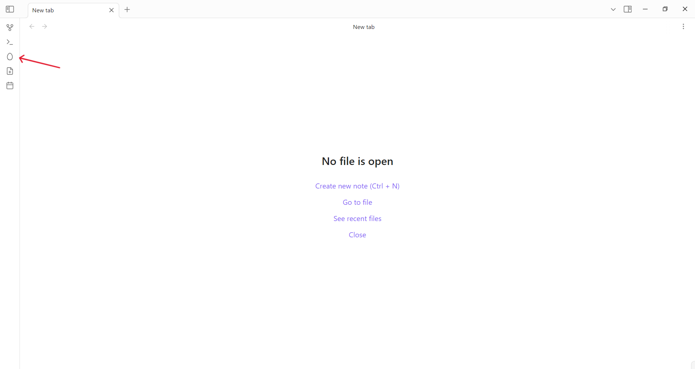
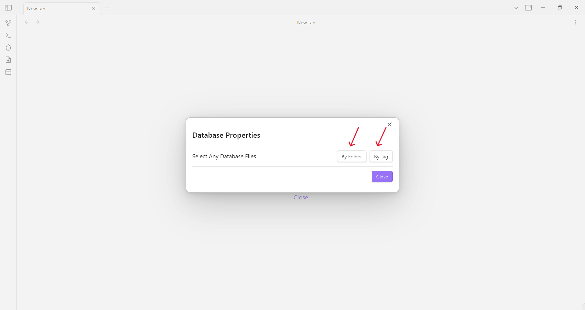
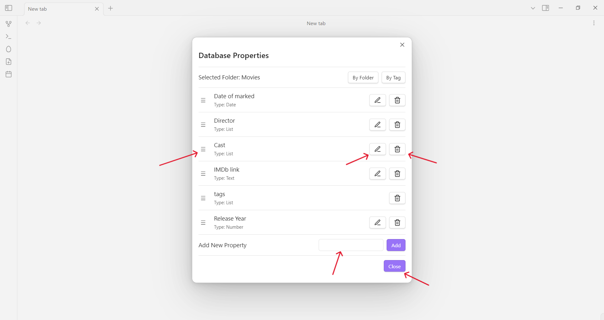
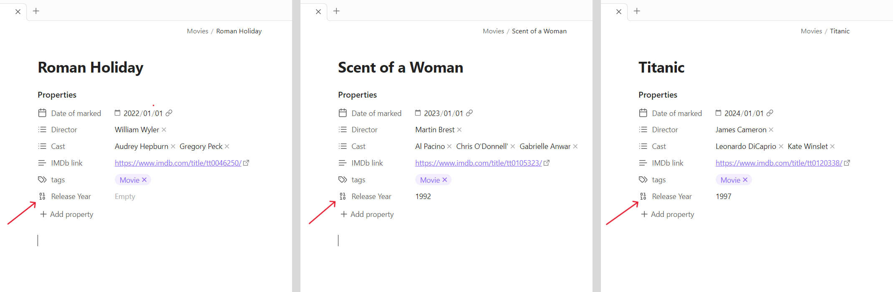
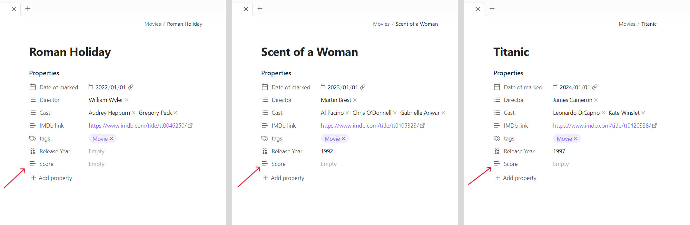
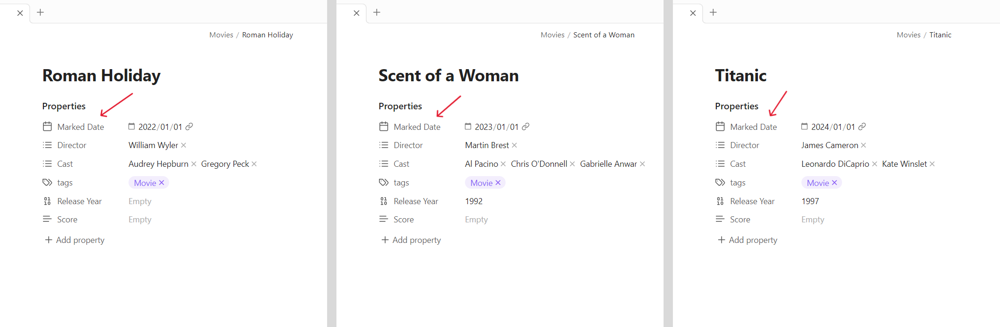
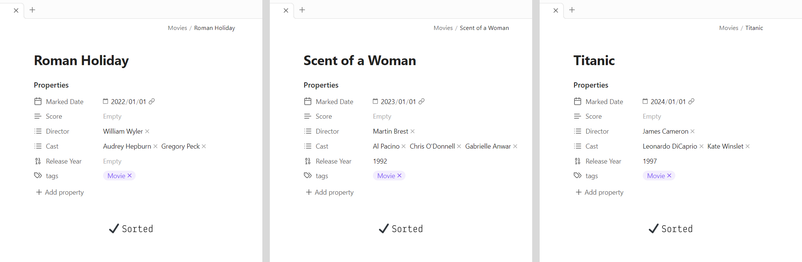
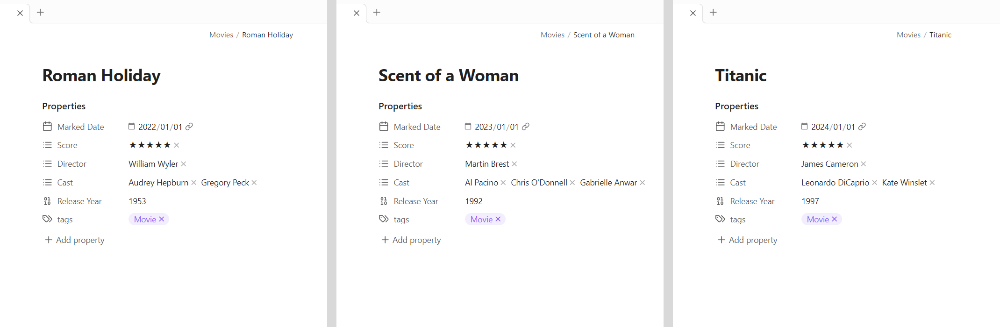

# Database Properties Plugin

Batch manage properties for Obsidian database files: Add, Delete, Modify, Sort.

## I. What are Obsidian database files?

Obsidian database files are files that share common properties (or need to share common properties).

For example, when you keep records of movies you've watched in Obsidian, these files are database files.

## II. What can this plugin do?

Let's say you have 3 movie record files. The latter two files have a new property "Release Year".

As someone with OCD tendencies, you must make the following modifications to sleep well:

- **Standardize**: Keep properties consistent across all files.

- **Add**: Add a new property "Score" to all files.

- **Delete**: Remove the "IMDb link" property from all files.

- **Modify**: Change the property name from "Date of marked" to "Marked Date" for all files.

- **Sort**: Arrange properties in the order of "Marked Date", "Score", "Director", "Cast", "Release Year", "tags".

## III. How to operate?

## IV. What are the effects?

**Standardize**: Simply click the save button.

You'll notice the first file now also has the "Release Year" property.

**Add**: Enter the new property name and click the add button.

You'll see all files now have the "Score" property.

**Delete**: Click the delete button next to the "IMDb link" property.

You'll notice the "IMDb link" property has disappeared from all files.

**Modify**: Click the modify button next to the "Date of marked" property.

You'll see "Date of marked" has been changed to "Marked Date" in all files.

**Sort**: Drag the "☰" icon on the left of the property names.

You'll find all properties are now arranged in your desired order.

Look, now those with OCD can rest easy.

## V. Notes

Newly added properties are text type and can be modified manually. It's simple - just modify it in one file, and other files will sync automatically.

This plugin only changes property names, not property values or file content.
